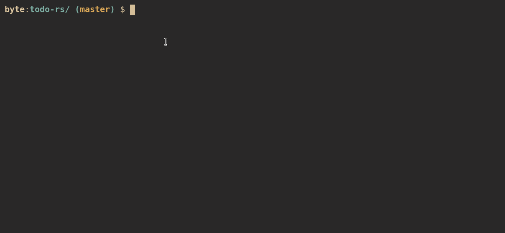

# Todo-rs



## About 

Todo-rs is a cli application written in rust. For drawing output to the screen it uses the [ANSI escape codes](https://en.wikipedia.org/wiki/ANSI_escape_code).

This project is heavily inspired by [this one](https://github.com/HadrienAka/todolist).

## Installation

It can be installed by running: 
```bash
cargo install --git "https://github.com/32byte/todo-rs.git"
```

## Requirements

 - A working rust installation
 - A unix system (I don't think windows CMD supports ANSI escape codes)
